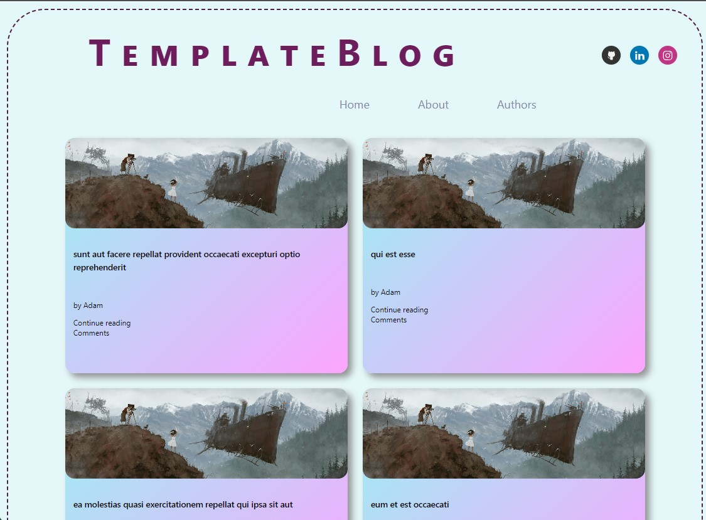

# Blog template




&nbsp;
 
## 💡 What has been used
- React
- JavaScript
- vanilla CSS styling
- Axios
- React Router DOM

&nbsp;

## 💿 Installation

To run this project, install it locally using npm:

```
$ npm install
$ npm start
```

&nbsp;

## 💭 Sorce of data

Project created with use of data from [JSON placeholder API](https://jsonplaceholder.typicode.com/)

&nbsp;

## 🙋‍♂️ Feel free to contact me
Find me on [LinkedIn](https://www.linkedin.com/in/karolina-zbonik-857797162/)